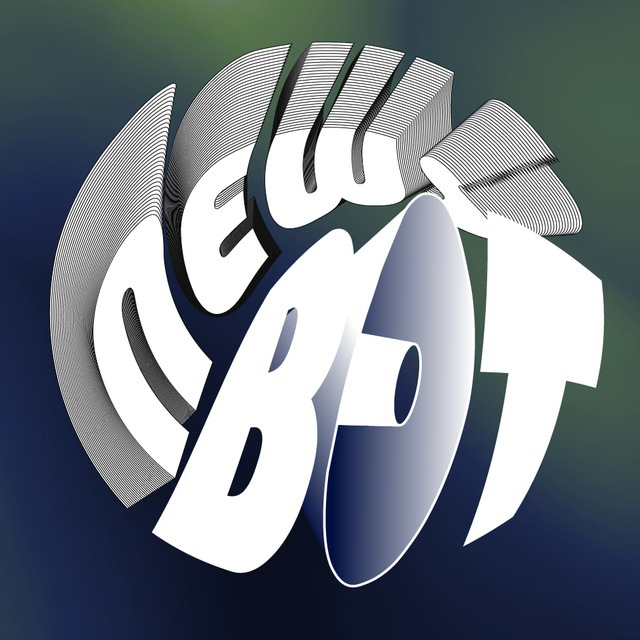
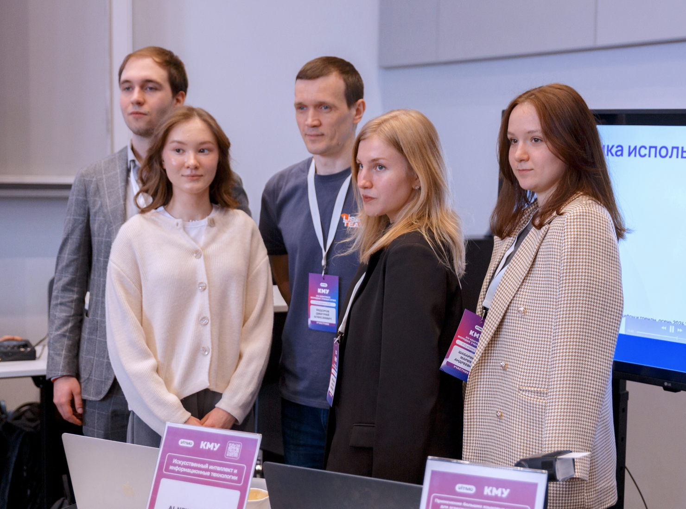

  <table>
    <tr>
      <td></td>
      <td><h1>NewsAI-ChatBot: Персонализированный новостной агрегатор с ИИ / Personalized news aggregator with AI</h1></td>
    </tr>
  </table>
  
  
  
  
  

 

## 🛠️ Технологический стек / Tech Stack

  
  
  
  
  
  
  
  
  
  
  
  
  

## 🚀 О проекте / About the project

  <table align="right">
    <tr>
      <td>
        <b> Этот проект </b> 
        модульная и масштабируемая система для сбора, индексации и персонализованной рассылки новостей с использованием современных NLP/ML компонентов.
      </td>
      <td>
        <b> This project </b> 
        is a modular, scalable system for collecting, indexing and delivering personalized news using modern NLP/ML components.
      </td>
    </tr>
  </table>

## ✨ Ключевые возможности / Key Features

  <table align="right">
    <tr>
      <td>
        <b> 🕹️ Быстрый старт / Quick start</b> 
        После входа в бота — начни диалог и выбери категории; система сама подберёт релевантные источники. / After starting the bot — begin conversation and select categories; the system auto-selects relevant sources.
      </td>
      <td></td>
    </tr>
  </table>
  
  <table>
    <tr>
      <td></td>
      <td>
        <b> 📊 Выбор категорий / Category selection</b> 
        Гибкая система тегов и ML‑категоризация позволяет точнее попадать в интересы пользователя. / Flexible tag system and ML categorization enable precise user interest matching.
      </td>
    </tr>
  </table>
  
  <table align="right">
    <tr>
      <td>
        <b> ✏️ Расскажи о себе </b> 
        Собираем сигналы поведения и используем семантические эмбеддинги для персональных рекомендаций. / We collect behavior signals and use semantic embeddings for personalized recommendations.
      </td>
      <td></td>
    </tr>
  </table>
  
  <table>
    <tr>
      <td></td>
      <td>
        <b> ⏰ Умная рассылка / Smart scheduling</b> 
        Настраиваем cron‑подобные правила и часовые пояса; apscheduler гарантирует точное срабатывание задач. / Cron-like rules and timezone-aware scheduling; apscheduler guarantees precise job execution.
      </td>
    </tr>
  </table>

## ⚙️ Архитектура системы

  
  <table>
    <tr>
      <td>
        <b> Парсер новостей </b> 
        Модуль собирает контент из RSS, HTML и внешних API; выполняется нормализация, дедупликация и базовая NLP‑предобработка (tokenization, language detection, minimal cleaning). Данные помещаются в документную БД и в индекс векторных эмбеддингов для быстрого поиска.
      </td>
      <td>
        <b> Ingest & Parser </b> 
        The parser ingests RSS, HTML and external APIs; performs normalization, deduplication and basic NLP preprocessing (tokenization, language detection). Content is stored in the document DB and a vector index for fast similarity search.
      </td>
    </tr>
    <tr>
      <td>
        <b> AI‑аналитик </b> 
        Взаимодействует с LLM (OpenAI GPT‑4) и локальными ML‑моделями (scikit‑learn, feature pipelines). Отвечает за категоризацию, суммаризацию, извлечение сущностей и генерацию персонализированных дайджестов. Для семантического поиска используется FAISS.
      </td>
      <td>
        <b> AI Analyst </b> 
        Interacts with LLM (OpenAI GPT‑4) and local ML models (scikit‑learn, feature pipelines). Responsible for categorization, summarization, entity extraction and personalized digest generation. FAISS is used for semantic nearest‑neighbor search.
      </td>
    </tr>
    <tr>
      <td>
        <b> Telegram‑бот </b> 
        Асинхронный интерфейс (aiogram + asyncio) принимает команды пользователей, управляет сессиями и отправляет дайджесты. Webhook/long‑polling реализуются через FastAPI/HTTP endpoints внутри контейнера.
      </td>
      <td>
        <b> Telegram Bot </b> 
        Async interface (aiogram + asyncio) handles user commands, sessions and digests. Webhook/long‑polling endpoints are exposed via FastAPI inside the container.
      </td>
    </tr>
    <tr>
      <td>
        <b> Хранилище и кэш </b> 
        MongoDB — первичный документный стор для статей, профилей пользователей и метаданных; FAISS хранит векторные индексы; Redis / RabbitMQ используются для кеша и очередей задач. Все постоянные данные снапшотятся и резервируются.
      </td>
      <td>
        <b> Storage & Cache </b> 
        MongoDB is the primary document store for articles, user profiles and metadata; FAISS keeps vector indexes; Redis / RabbitMQ are used for caching and job queues. Snapshots and backups are maintained.
      </td>
    </tr>
    <tr>
      <td>
        <b> Планировщик и оркестрация </b> 
        apscheduler управляет периодическими задачами: парсинг, обновление индексов, триггеры рассылок. Docker обеспечивает изоляцию и воспроизводимость окружения; опционально — Kubernetes для авто‑масштабирования.
      </td>
      <td>
        <b> Scheduling & Orchestration </b> 
        Apscheduler manages periodic jobs: crawl, index updates and mailing triggers. Docker provides isolation and reproducible runtime; optionally Kubernetes can be used for autoscaling.
      </td>
    </tr>
  </table>

## 👥 Наша команда / Team members

  <table>
    
    
  </tab>

### Наш проект участвует в престижных программах / Our project has participated in various events:

## 📑 Лицензия

Этот проект распространяется под лицензией. Подробнее см. в файле [LICENSE](LICENSE).

---

⭐ **Не забудьте поставить звезду репозиторию, если проект вам понравился!**

