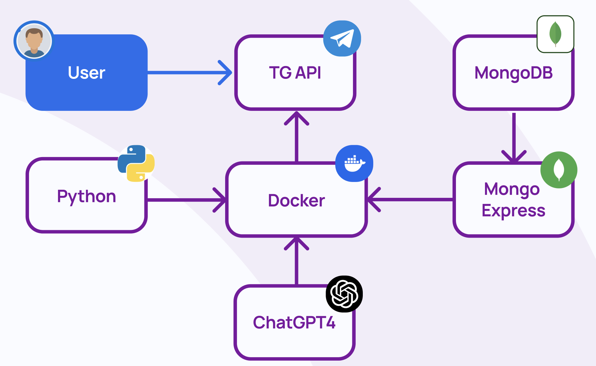

<div align="center"> <table> <tr> <td></td> <td><h1>NewsAI Bot: Персонализированный новостной агрегатор</h1></td> </tr> </table>

[](https://t.me/ProclamatorBot)
[](https://python.org)
[](https://docker.com)

</div>

## 🚀 О проекте

NewsAI Bot — это интеллектуальная система для агрегации и анализа новостей с использованием современных AI-технологий. Бот собирает новости из различных источников, анализирует их с помощью языковых моделей и создает персонализированные дайджесты для пользователей Telegram.

<div align="center">
  
</div>

## ✨ Ключевые возможности

<div style="display: grid; grid-template-columns: repeat(auto-fit, minmax(300px, 1fr)); gap: 20px; margin: 30px 0;">

<div style="display: flex; align-items: center;">
  <div style="flex: 1;">
    
  </div>
  <div style="flex: 1; padding: 0 20px;">
    <h3>📰 Автоматический сбор новостей</h3>
    <p>Из множества источников с интеллектуальной фильтрацией и категоризацией</p>
  </div>
</div>

<div style="display: flex; align-items: center; flex-direction: row-reverse;">
  <div style="flex: 1;">
    
  </div>
  <div style="flex: 1; padding: 0 20px;">
    <h3>🤖 AI-анализ контента</h3>
    <p>С использованием LLM (GPT-4o mini) для суммаризации и категоризации</p>
  </div>
</div>

<div style="display: flex; align-items: center;">
  <div style="flex: 1;">
    
  </div>
  <div style="flex: 1; padding: 0 20px;">
    <h3>📊 Персонализация новостей</h3>
    <p>Подбор контента по интересам каждого пользователя</p>
  </div>
</div>

<div style="display: flex; align-items: center; flex-direction: row-reverse;">
  <div style="flex: 1;">
    
  </div>
  <div style="flex: 1; padding: 0 20px;">
    <h3>⏰ Умная рассылка</h3>
    <p>Автоматическая отправка дайджестов по расписанию</p>
  </div>
</div>

</div>

## 🛠️ Технологический стек

<div align="center">


</div>

## 🏗️ Архитектура системы

<div align="center">
  
</div>

Система состоит из нескольких взаимосвязанных компонентов:

1. **Парсер новостей** - сбор и предварительная обработка контента
2. **AI-аналитик** - категоризация и суммаризация новостей
3. **Telegram-бот** - интерфейс взаимодействия с пользователями
4. **База данных** - хранение новостей, пользователей и дайджестов
5. **Планировщик** - управление периодическими задачами

## 👥 Наша команда

<div align="center">
  
</div>

## 📜 Аккредитация

<div align="center" style="margin: 40px 0;">

### Наш проект участвует в престижных программах:


</div>

<div align="center">
  
</div>

## 🗂️ Структура проекта

```
news-ai-bot/
├── docker-compose.yml
├── Dockerfile
├── README.md
├── LICENSE
├── docs/
│   ├── logo.jpeg
│   ├── sheme.png
│   ├── team1.png
│   └── team2.png
└── pseudocode/
    ├── app/
    │   └── telegram_bot.py
    ├── llm.py
    ├── parser.py
    ├── docker-compose.yml
    └── Dockerfile
```

## 📄 Лицензия

Этот проект распространяется под лицензией. Подробнее см. в файле [LICENSE](LICENSE).

---

<div align="center">

⭐ **Не забудьте поставить звезду репозиторию, если проект вам понравился!**

[](https://t.me/ProclamatorBot)

</div>